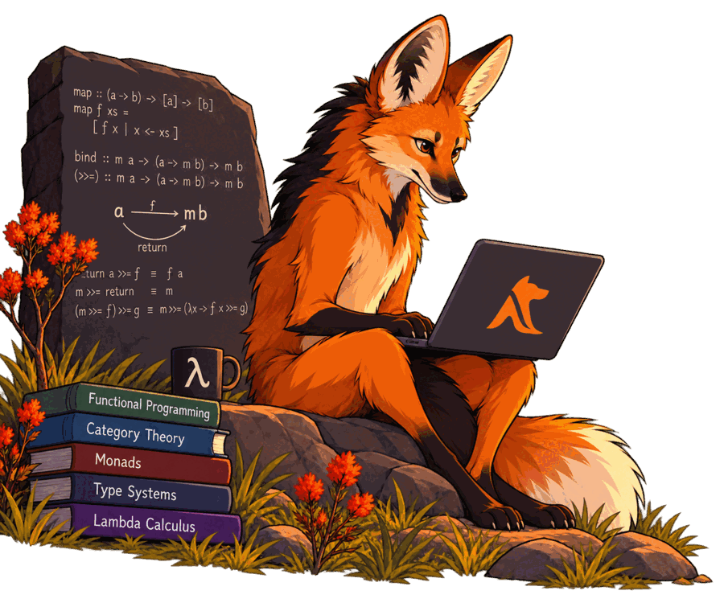

# Maned



Maned is an **integer-only dataflow language** (`.mnd`) for linear algebra and
small ML workloads.

A program declares its quantization contract, its inputs and outputs, and a set
of `calc::lambda_flow` dataflow graphs written in reverse Polish notation. The
toolchain runs them locally, serves them as an HTTP API, or offloads them to
remote BARK workers over the CDP wire protocol — with bit-exact, reproducible
integer results everywhere.

```mnd
mnd::quantmax = 1000;
mnd::quantmin = -1000;
mnd::quantres = 0;

in::x    = [[2,0],[0,2]];
in::w    = [[3,4],[5,6]];
in::bias = [[0,0],[0,-100]];

calc::lambda_flow layer(x, w, bias) {
    x w matmul    p =
    p bias elemwise_add s =
    s relu        result =
} return result;
```

```text
$ maned-run layer.mnd
flow 'layer' outputs:
result : [2x2] = [6, 8, 10, 0]
```

## Install

macOS and Linux, prebuilt. Nothing to compile, no runtime to install first:

```sh
curl -fsSL https://fabianodicheti.github.io/maned/install.sh | sh
```

Or with Homebrew:

```sh
brew install fabianodicheti/maned/maned
```

That installs `maned-run`, `maned-serve` and `maned-lint`. It never uses
`sudo` and never edits your shell configuration. Check it worked:

```sh
maned-run --version
```

Full details — installer options, installing by hand, checksum verification,
editor support, supported platforms and troubleshooting — are on the
[Install](install.html) page.

## What makes it different

**No floating point, anywhere.** The runtime is integer-only, so "what does the
integer 500 mean?" is not an implementation detail discovered later — it is the
first thing the file says. The same program cannot mean one thing on a laptop
and another on an FPGA.

**No operator precedence, no parentheses.** Every expression is read left to
right against an operand stack. The token order *is* the dependency order,
which is exactly what a dataflow graph and a hardware back end need.

**The same answer on every machine.** Local runs and remote workers compile the
same integer kernels, and `maned-run --verify` re-runs a flow locally and
compares the results exactly, so the claim is checkable rather than asserted.


## Start here

| If you want to | Read |
|---|---|
| Install the toolchain in one command | [Install](install.html) |
| Learn the language and its RPN model | [Language guide](guides/language.html) |
| Do integer linear algebra — scale, solvers, matmul idioms | [Linear algebra](linear-algebra.html) |
| Train a model — the ten `calc::ml::` algorithms | [Machine learning](guides/machine-learning.html) |
| Spread training across workers | [Training across Bark devices](guides/ml-parallel.html) |
| Turn a spare x86 machine into a worker | [Set up a Bark machine](bark-machines.html) |
| Understand what happens when you hit enter | [How Maned runs your program](under-the-hood.html) |
| Offload flows to workers, or run the Bark VM | [Remote workers](guides/remote-workers.html) |
| Look up an error or warning code | [Diagnostics reference](guides/diagnostics.html) |
| Find the authoritative rule for a syntax question | [RPN syntax specification](spec/rpn-syntax.html) |

## The tools

| Tool | Purpose |
|---|---|
| `maned-run` | Run a `.mnd` program — locally, on the local Bark VM, or on remote workers |
| `maned-serve` | Serve one `.mnd` script as an HTTP API |
| `maned-lint` | Static checks with editor-parseable diagnostics |
| `maned-opt` | MLIR pipeline driver (needs an MLIR install; the three above do not) |
| `mnpk-gen` | Protocol envelope generation and mutation, for wire-protocol testing |

## Which document wins

Three references overlap. When they disagree:

1. **The implementation and its tests are the ground truth.** On conflict with every document, the docs carry the bug.
2. **The [RPN syntax specification](spec/rpn-syntax.html) is normative** — among documents, it wins.
3. **The [language guide](guides/language.html) is the primary reading entry** — complete but descriptive. It teaches; it does not rule.

Two of these pages are **drift-checked by tests in both directions**: the
toolchain must be documented, *and* the docs must not invent codes or
operations that do not exist. Those are
[Diagnostics](guides/diagnostics.html) (every error and warning code) and the
operations table in the [language guide](guides/language.html) (every
operation, with its summary counts pinned to the registry). Adding a code or
an operation without documenting it fails the build.
